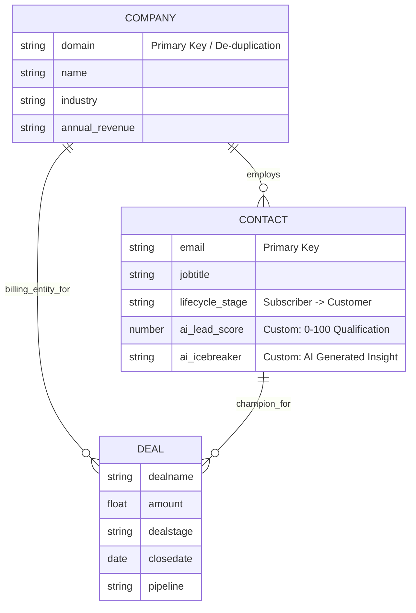

# Breezy HubSpot Integration POC

This repository contains a Proof of Concept (POC) demonstrating a seamless integration between Breezy's platform and HubSpot CRM. It showcases data synchronization, deal management, and AI-powered sales intelligence.

## A. Setup Instructions

### Prerequisites
- Node.js (v18+ recommended)
- A HubSpot account with Super Admin access (to create Private Apps)
- A Google Cloud Project with Gemini API access (or a Gemini API key)

### Environment Variables
Create a `.env` file in the root directory:
```bash
cp .env.example .env
```
Ensure the following variables are set:
- `HUBSPOT_ACCESS_TOKEN`: Private App token with `crm.objects.contacts`, `crm.objects.deals` (read/write), and `crm.schemas.deals` (read) scopes.
- `GEMINI_TOKEN`: API key for Google Gemini (Generative AI).

### Installation & Local Execution

**Quick Start**

1.  **Install everything:**
    ```bash
    npm run setup
    ```

2.  **Run the App (Server + Client):**
    ```bash
    npm start
    ```
    - Server: http://localhost:3001
    - Client: http://localhost:5173

    > **To stop the app:** Press `Ctrl + C` in the terminal to shut down both the server and client.

**Manual Startup (Optional)**

If you prefer to run them separately:
- Server: `npm run server:dev`
- Client: `npm run client:dev`

---

## B. Project Overview

This POC demonstrates how Breezy can leverage HubSpot as its central customer truth source while maintaining a custom, high-performance application experience.

**Key Capabilities:**
-   **Bi-directional Sync**: Creates and retrieves Contacts and Deals in real-time.
-   **Sales Intelligence**: Uses Generative AI to score leads and provide actionable sales tips based on prospect data.
-   **Secure Architecture**: Backend-for-Frontend (BFF) pattern ensures API keys are never exposed to the client.

---

## C. AI Usage Documentation

**AI Tools Used:**
> This section is not written by AI

- Utilized Google's Antigravity IDE coupled with Gemini 3 Pro (high) for orchestration of the application build itself. I simply guided the agentic platform towards several iterations of testing and adding features until requirements were met. I used Gemini to generate the inital prompt to ensure the agentic platform had a verbose and clearly defined set of requirements to avoid halucinations and ensure quicker adhearance to my own preferences of language choice, simplicity in design, and ease of deployment. 
- This was an exercise of learning about the new Antigravity IDE and how to guide it to create, test, and ensure the application is secure by following simple design philosophy and efficiency.
- The AI feature within the application simply uses a faster, lower cost and faster model (gemini 2.5 flash lite) within Google's free-tier in Google AI Studio.
- Gemini also assisted me in parsing HubSpot documentation to better understand the platform itself and data models associatd. 

---

## D. HubSpot Data Architecture

### Entity Relationship Diagram (ERD)
The architecture follows a standard B2B CRM pattern (Company-Centric), ensuring that data is organized by Account rather than just individual people. This supports Breezy's high-volume sales motion by grouping multiple leads under one organization.



### Design Decisions & Rationale

1.  **Company-First Architecture**:
    *   **Relation**: `COMPANY ||--o{ CONTACT`
    *   **Why**: Breezy sells to businesses, not just people. Using the `Company` object allows sales reps to see all stakeholders (Contacts) for a single Account in one view. It prevents data silos where 5 people from the same company exist as unconnected records.

2.  **Custom AI Properties**:
    *   **Properties**: `ai_lead_score` (Number), `ai_icebreaker` (String)
    *   **Why**: Storing AI insights as structured data properties (rather than just Notes) is critical. It allows Breezy to:
        *   Create **Active Lists** of "Hot Leads" (e.g., Score > 80).
        *   Trigger **Workflows** to auto-assign high-scoring leads.
        *   Visualize lead quality in **Reports**.

3.  **Deal Associations**:
    *   **Relation**: `COMPANY` is the primary parent of `DEAL`.
    *   **Why**: If a Contact leaves their job (the "Champion"), the Deal should not be orphaned. Associating Deals with the Company ensures historical revenue data remains intact even as employees churn.

---

## E. AI Feature Explanation

### Feature: Smart Lead Qualification (Sales Intelligence)

**Description:**
When a contact is viewed or created, the system uses Google Gemini to analyze their `jobtitle` and `company` fields. It assigns a numerical score (0-100) and provides a specific "icebreaker" or talking point.

**Why this feature?**
Breezy likely generates high volumes of signups. Sales reps cannot manualy review every lead. This feature instantly highlights "High Priority" prospects (e.g., CTOs, VPs) versus casual browsers.


---

## F. Design Decisions

**Technical Choices:**
-   **Express.js Proxy**: Chosen to securely manage the HubSpot Private App Token. Direct client-side calls would expose credentials.
-   **React + Vite**: Provides a snappy, modern SPA experience that Breezy users expect, decoupled from the monolithic CRM UI.
-   **Gemini Flash**: Selected for speed/cost balance essential for real-time features.
