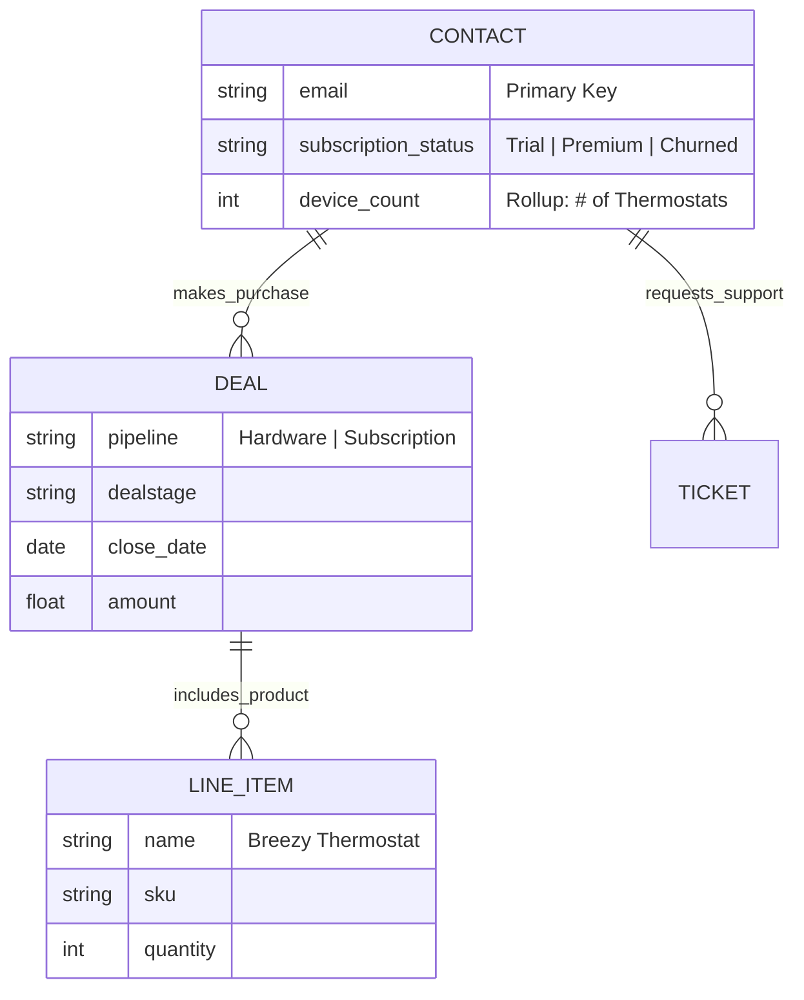

# Breezy HubSpot Integration POC

This repository contains a Proof of Concept (POC) demonstrating a seamless integration between Breezy's platform and HubSpot CRM. It showcases data synchronization, deal management, and AI-powered sales intelligence.

## A. Setup Instructions

### Prerequisites
- Node.js (v18+ recommended)
- A HubSpot account with Super Admin access (to create Private Apps)
- A Google Cloud Project with Gemini API access (or a Gemini API key)

### Environment Variables
Create a `.env` file in the root directory:
```bash
cp .env.example .env
```
Ensure the following variables are set:
- `HUBSPOT_ACCESS_TOKEN`: Private App token with `crm.objects.contacts`, `crm.objects.deals` (read/write), and `crm.schemas.deals` (read) scopes.
- `GEMINI_TOKEN`: API key for Google Gemini (Generative AI).

### Installation & Local Execution

**Quick Start**

1.  **Install everything:**
    ```bash
    npm run setup
    ```

2.  **Run the App (Server + Client):**
    ```bash
    npm start
    ```
    - Server: http://localhost:3001
    - Client: http://localhost:5173

    > **To stop the app:** Press `Ctrl + C` in the terminal to shut down both the server and client.

**Manual Startup (Optional)**

If you prefer to run them separately:
- Server: `npm run server:dev`
- Client: `npm run client:dev`

---

## B. Project Overview

This POC demonstrates how Breezy can leverage HubSpot as its central customer truth source while maintaining a custom, high-performance application experience.

**Key Capabilities:**
-   **Bi-directional Sync**: Creates and retrieves Contacts and Deals in real-time.
-   **Sales Intelligence**: Uses Generative AI to score leads and provide actionable sales tips based on prospect data.
-   **Secure Architecture**: Backend-for-Frontend (BFF) pattern ensures API keys are never exposed to the client.

---

## C. AI Usage Documentation

**AI Tools Used:**
> This section is not written by AI

- Utilized Google's Antigravity IDE coupled with Gemini 3 Pro (high) for orchestration of the application build itself. I simply guided the agentic platform towards several iterations of testing and adding features until requirements were met. I used Gemini to generate the inital prompt to ensure the agentic platform had a verbose and clearly defined set of requirements to avoid halucinations and ensure quicker adhearance to my own preferences of language choice, simplicity in design, and ease of deployment. 
- This was an exercise of learning about the Antigravity IDE and how to guide it to create, test, and ensure the application is secure by following simple design philosophy and efficiency. In addition to learning about HubSpots API, object modeling, and data models associated. 
- The AI feature within the application simply uses a faster, lower cost and faster model (gemini 2.5 flash lite) within Google's free-tier in Google AI Studio.
- Gemini also assisted me in parsing HubSpot documentation to better understand the platform itself and data models associated.
- AI Helped tremendously and allowed me to create a much more polished product as a PoC. AI allowed me to provide a declarative state of functions, and features, and orchestrate the implementation versus manually coding each feature and function.
- AI also helped me to better understand the platform and data models associated with HubSpot, and talk through various design options (such as language choice, build tools, styling tools, etc)
- However, for the purpose of this PoC, the application has several external dependencies. AI tended to add dependencies that were not necessary for the PoC, and I had to remove them manually. Or, over engineered tooling for the context of this assignment. 

- What was Challenging:
  - The most challenging aspect of this PoC was not technical, however it was focusing on the customer, their business, and the business use-case for this application. AI took care of a majority of the technical nuance based on my guidance, however it was not as useful in terms of understanding the business use-case and customer needs from a consultative perspective. 

---

## D. HubSpot Data Architecture

### Entity Relationship Diagram (ERD)
The architecture follows a **B2C Consumer-Centric** pattern, designed for a high-volume hardware + SaaS business. The `Contact` is the primary entity, with revenue tracked via distinct pipelines for Hardware Sales and Subscription Management.



### Design Decisions & Rationale

> This section was written with AI assistance to review options for Breezy data modeling and architecture.

1.  **Consumer-First Architecture (B2C)**:
    *   **Relation**: `CONTACT` is the central node.
    *   **Why**: Breezy sells directly to homeowners.

2.  **Dual-Pipeline Strategy**:
    *   **Mechanism**: Separate Deal Pipelines for "Hardware Sales" and "Subscriptions".
    *   **Why**: These are two different business models.
        *   **Hardware**: Linear flow (Checkout -> Shipped -> Delivered).
        *   **Subscription**: Recurring/Lifecycle flow (Trial -> Active -> Churned).
        Separating them allows for accurate forecasting and distinct reporting for the hardware vs. SaaS divisions.

3.  **Expansion & Upsell Logic**:
    *   **Property**: `device_count` (Rollup).
    *   **Why**: By tracking how many thermostats a customer owns (via Line Items on Won Deals), we can identify "Power Users" for targeted Premium marketing. A customer with 3+ devices is a prime target for a "Whole Home" premium plan.

4.  **Support Integration**:
    *   **Relation**: `CONTACT ||--o{ TICKET`
    *   **Why**: In Smart Home tech, post-sales support is critical. Linking Tickets to Contacts ensures that if a Trial user complains about setup, the Success team can intervene immediately to prevent churn.

---

## E. AI Feature Explanation

### Feature: Smart Lead Qualification (Sales Intelligence)

**Description:**
When a contact is viewed or created, the system uses Google Gemini to analyze their `jobtitle` and `company` fields. It assigns a numerical score (0-100) and provides a specific "icebreaker" or talking point.

**Why this feature?**
Breezy likely generates high volumes of signups. Sales reps cannot manualy review every lead. This feature instantly highlights "High Priority" prospects (e.g., CTOs, VPs) versus casual browsers.


---

## F. Design Decisions

> This section is not written by AI

**Technical Choices:**
-   **Express.js Proxy**: Chosen to securely manage the HubSpot Private App Token. Direct client-side calls would expose credentials.
-   **React + Vite**: Built as a stateless front end to query HubSpot vs maintaining a PG db for local hosting and bi-directional sync.
-   **Gemini Flash**: Selected for speed/cost balance essential for real-time features.

- Compared object sync best practices outline here: https://github.com/hubspotdev/crm-object-sync
  - This PoC differs in the following ways:
    - Stateless, opposed to hosting data in postgres - Ensures HubSpot is the single source of truth
    - Sync Strategy - direct query of hubspot API opposed to client side enforced sync (will not overwrite hubspot data)
    - Authentication - Used private app token for simplicity vs oAuth
  - Design Benefits:
    - Simpler to deploy and maintain
    - No need to manage a database
    - No need to manage authentication per user
  - Design Drawbacks:
    - Scalability
    - Potential API rate limiting errors
    - Actions not tied to a specific user (relees on legacy app token)

- Future Improvements:
  - Implement rate limiting - dynamic back off timers based on API response
  - Implement pagination - As contacts grow, currently the app will load all contacts at once which is not scalable
  - Improve scalability by implementing best practice object sync as defined in https://github.com/hubspotdev/crm-object-sync
    - Solve high-volume latency issues with current API query only implementation

- What to ask the client before building production version:
  - What aspects of customer data have historically indicated the highest value prospects?
    - Utilize this to improve data gather by front-end and prompt used by AI Feature to improve lead qualification
  - Average volume of contacts and deals added
    - Justify need for improved scalability, review best practice of data storage (PG db) 
