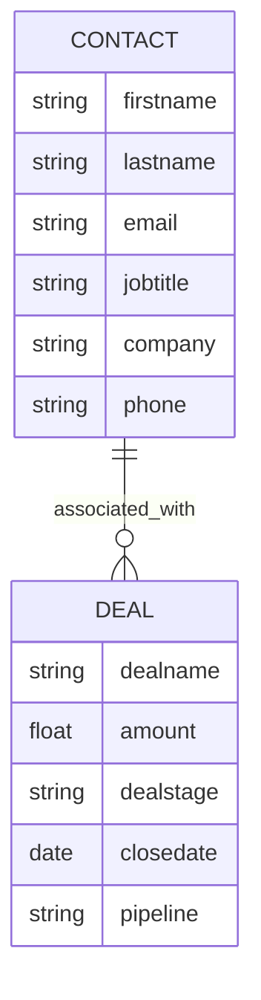

# Breezy HubSpot Integration POC

This repository contains a Proof of Concept (POC) demonstrating a seamless integration between Breezy's platform and HubSpot CRM. It showcases data synchronization, deal management, and AI-powered sales intelligence.

## A. Setup Instructions

### Prerequisites
- Node.js (v18+ recommended)
- A HubSpot account with Super Admin access (to create Private Apps)
- A Google Cloud Project with Gemini API access (or a Gemini API key)

### Environment Variables
Create a `.env` file in the root directory:
```bash
cp .env.example .env
```
Ensure the following variables are set:
- `HUBSPOT_ACCESS_TOKEN`: Private App token with `crm.objects.contacts`, `crm.objects.deals` (read/write), and `crm.schemas.deals` (read) scopes.
- `GEMINI_TOKEN`: API key for Google Gemini (Generative AI).

### Installation & Local Execution

**Quick Start**

1.  **Install everything:**
    ```bash
    npm run setup
    ```

2.  **Run the App (Server + Client):**
    ```bash
    npm start
    ```
    - Server: http://localhost:3001
    - Client: http://localhost:5173

    > **To stop the app:** Press `Ctrl + C` in the terminal to shut down both the server and client.

**Manual Startup (Optional)**

If you prefer to run them separately:
- Server: `npm run server:dev`
- Client: `npm run client:dev`

---

## B. Project Overview

This POC demonstrates how Breezy can leverage HubSpot as its central customer truth source while maintaining a custom, high-performance application experience.

**Key Capabilities:**
-   **Bi-directional Sync**: Creates and retrieves Contacts and Deals in real-time.
-   **Sales Intelligence**: Uses Generative AI to score leads and provide actionable sales tips based on prospect data.
-   **Secure Architecture**: Backend-for-Frontend (BFF) pattern ensures API keys are never exposed to the client.

---

## C. AI Usage Documentation

**AI Tools Used:**

---

## D. HubSpot Data Architecture

### Entity Relationship Diagram (ERD)
The architecture follows a standard CRM pattern where a Contact is the central person object, and Deals represent revenue opportunities.



---

## E. AI Feature Explanation

### Feature: Smart Lead Qualification (Sales Intelligence)

**Description:**
When a contact is viewed or created, the system uses Google Gemini to analyze their `jobtitle` and `company` fields. It assigns a numerical score (0-100) and provides a specific "icebreaker" or talking point.

**Why this feature?**
Breezy likely generates high volumes of signups. Sales reps cannot manualy review every lead. This feature instantly highlights "High Priority" prospects (e.g., CTOs, VPs) versus casual browsers.


---

## F. Design Decisions

**Technical Choices:**
-   **Express.js Proxy**: Chosen to securely manage the HubSpot Private App Token. Direct client-side calls would expose credentials.
-   **React + Vite**: Provides a snappy, modern SPA experience that Breezy users expect, decoupled from the monolithic CRM UI.
-   **Gemini Flash**: Selected for speed/cost balance essential for real-time features.
